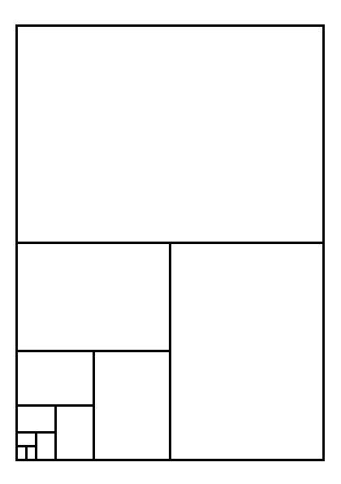

# Paper Sizes
There are various [standards][wikipedia:paper_sizes] that specify paper sizes. A popular one is the _A-series_, which we will explore in some detail in this chapter.

## A-series
The A-series of paper sizes, that range from A0 to A10, has interesting properties that allow one to deduce a lot about the actual dimensions of each type.

The first property is that A0, the largest in the series, has an area of exactly 1 square meter. Each next type in the series is half as big in area as its predecessor.

The second property is that each type has a similar shape. This means that if one could shrink or grow a certain type with an appropriate amount, you would be able to produce all the other types.

## Dimensions
If you are into those things, you can put pen to paper and figure out the exact dimensions for each type of paper in the A-series. We do just that below the summary of the results.

The next table summarizes the calculations below and lists width and height in millimeters for the types in of paper in the A-series when in portrait mode.

| Type | Width (mm)  | Height (mm) |
|------|-------------|-------------|
| A0   | 841         | 1189        |
| A1   | 594'        | 841         |
| A2   | 420         | 594'        |
| A3   | 297         | 420         |
| A4   | 210         | 297         |
| A5   | 148'        | 210         |
| A6   | 105         | 148'        |
| A7   | 74          | 105         |
| A8   | 52'         | 74          |
| A9   | 37          | 52'         |
| A10  | 26          | 37          |

The numbers with an accent are taken from the standard and deviate from the calculated value due to different rounding scheme.

## Calculation

Take a look at the above diagram. We will use it to figure out the dimensions of the various types of paper in the A-series.

We know that all the papers have similar size. So to get started we are going to figure out how much longer the long side is compared to the short side.

### Scaling Factor
We set the width to 1 unit and for our convience the height to \\(2x\\) units. Since the two sheets of paper one type down make up one of the starting type, and since the shapes are similar, meaning they have the same ratio we find out that

\\[
\frac{2x}{1} = \frac{1}{x}
\\]

By multiplying with \\(x\\) on both sides we find that

\\[
2x^{2} = 1
\\]

Or

\\[
x^{2} = \frac{1}{2}  
\\]

This equation has two solutions, one negative and one positive. Since we are looking for a length, only the positive one makes sense.

\\[
x = \sqrt{\frac{1}{2}} = \frac{\sqrt{1}}{\sqrt{2}} = \frac{1}{\sqrt{2}}\cdot 1 = \frac{1}{\sqrt{2}}\frac{\sqrt{2}}{\sqrt{2}} = \frac{1}{\sqrt{2}\cdot\sqrt{2}}\frac{\sqrt{2}}{1} = \frac{1}{2}\sqrt{2}
\\]

With the scaling factor being twice \\(x\\) the scaling factor becomes \\(\sqrt{2}\\).

### Dimension of A0
We now know the scaling factor. The next step is finding out the dimension of a sheet of A0 paper. The defining property, besides the ratio between the sides, is that A0 has an area of 1 square meter. Let's figure out the dimensions from that.

Let \\(s\\) be the short side of an A0 sheet of paper. The long side would then be \\(s\sqrt{2}\\). Its area becomes

\\[
s^{2}\cdot\sqrt{2} = 1   
\\]

or

\\[
s^{2} = \frac{1}{\sqrt{2}}
\\]

We are still looking for a size, again we are interested in the positive solution of this equation.

\\[
s = \frac{1}{\sqrt[4]{2}} \approx 0.8408964152537145430311254762332148950400342623567845108132260859\ldots
\\]

The dimensions of the A0 sheet of paper then becomes in millimeters 841 by 1189.

[wikipedia:paper_sizes]: https://en.wikipedia.org/wiki/Paper_size
