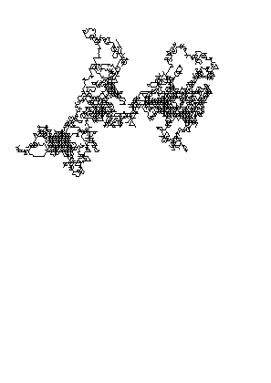

# Brownian Motion

[_Brownian motion_][wikipedia:brownian-motion] is

> the random motion of particles suspended in a medium.

[wikipedia:brownian-motion]: https://en.wikipedia.org/wiki/Brownian_motion