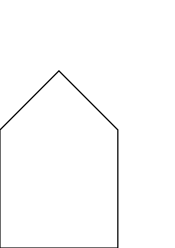

# Hello, World


The practice of a ["Hello, World!" program][wikipedia:hello-world], i.e. a simple program to demonstrate that your tool chain works as intended, has many forms. For PostScript this would be outputting a single line. In this chapter we are going to achieve just that.

## Start your engines
Getting feedback is important. The sooner, the better. That is why we are going to use [Ghostscript][ghostscript].

Ghostscript is

> an interpreter for the PostScript® language and PDF files. Ghostscript consists of a PostScript interpreter layer and a graphics library.

You can find some notes about installing Ghostscript in [the appendix][book:appendix:ghostscript].

Go ahead and start a Ghostscript session.

> **Note**: Ghostscript on macOS does not have a rendered output.
> Instead of using the REPL you can write the instructions to a file and use `ps2pdf` to generate a PDF
> or use the PostScript interpreter on **<https://postscript-render.fly.dev/>** for this workshop.

## Read-Eval-Print-Loop
When you start Ghostscript the following things happen:

1. A window is opened that shows a blank page. The page will show the output of the PostScript program that we enter.
2. A Read-Eval-Print-Loop (REPL) is started. Via this REPL we can communicate with the PostScript interpreter.

The REPL first prints a header, something akin

```
Copyright (C) 2019 Artifex Software, Inc.  All rights reserved.
This software is supplied under the GNU AGPLv3 and comes with NO WARRANTY:
see the file COPYING for details.
```

And offers a prompt

```
GS>
```

## Let's get moving
We will interact with the page by executing commands in the REPL. The first command will be `moveto`.

Enter the following line into the REPL.

```ps
{{#include ../../image-src/hello-world.ps:2:2}}
```

Even when you look closely, the page will not be changed. The only thing that happened is that the _current path_ is extended with a move to the origin. What this means will become clear in later chapters.

## Draw the line
The next step in this walkthrough is drawing the line. This can be achieved with the `lineto` command

```ps
{{#include ../../image-src/hello-world.ps:3:3}}
```

Again, nothing seems to have changed on the page. The PostScript interpreter only extended the _current path_ with a line.

## Stroke the current path
Only when we issue the `stroke` command, will the PostScript interpreter update the page.

```ps
{{#include ../../image-src/hello-world.ps:4:4}}
```

## Celebrate 🎉
With a line drawn on the page, you are well on your way to becoming a master of PostScript!

## Final Thoughts
### showpage
If you want to experiment some more it could be nice to start with a clean slate. The `showpage` command can be used for this. When you issue it

```ps
{{#include ../../image-src/hello-world.ps:5:5}}
```

The REPL will respond with

```
>>showpage, press <return> to continue<<
```

When you continue the page is updated and you start in a fresh state. For an actual printer, the `showpage` command would instruct the printer to print all the marks on actual paper!

### newpath
We have seen that the PostScript interpreter maintains a current path, and `moveto` and `lineto` commands modify it and `stroke` renders it on the page.

If you want to make sure that you start with a clean slate you can issue the `newpath` command. This will clear the current path and allows you to start anew.

## Summary
We have created our first PostScript program by entering the following commands in the REPL.

```ps
{{#include ../../image-src/hello-world.ps}}
```

It uses the following commands:

* `newpath`: clears the current path.
* `moveto`: extends the current path, and sets the current point.
* `lineto`: extends the current path with a line from the current point to the point as specified by the arguments.
* `stroke`: draws the current path.
* `showpage`: Evicts the page and starts a new one.

## Exercises
1. What does the following program draw?

```ps
{{#include ../../image-src/cross.ps}}
```

2. With the commands you learned draw a simple house that looks like the house below


[book:appendix:ghostscript]: ../appendix/ghostscript.html
[ghostscript]: https://www.ghostscript.com/index.html
[wikipedia:hello-world]: https://en.wikipedia.org/wiki/%22Hello,_World!%22_program
